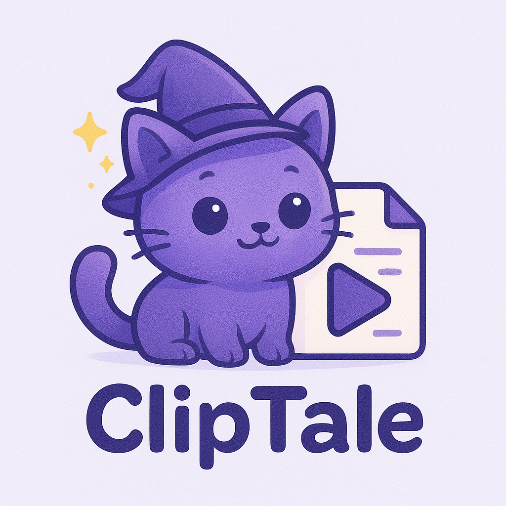

# ClipTale

This is the repo for **ClipTale**, a desktop app that helps video content makers manage their clips more easily.

    

- **Github repository**: <https://github.com/WSQsGithub/ClipTale/>
- **Documentation** <https://WSQsGithub.github.io/ClipTale/>

## Roadmap

- [x] **v0.0.0**: Basic functionality (auto-relabelling, clip management, etc.) and simple CLI.
- [ ] **v0.1.0**: Basic GUI.
- [ ] **v0.2.0**: Smart clip management.
- [ ] **v0.3.0**: Editing inspiration generation.

## Contributing

We welcome contributions! Please read our [contributing guide](CONTRIBUTING.md) for more information.

